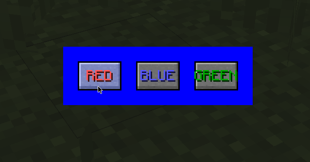
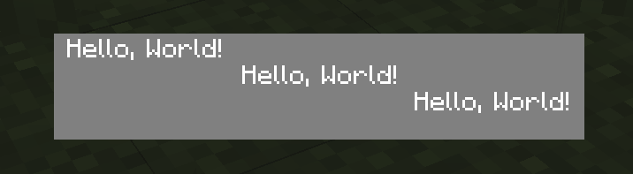
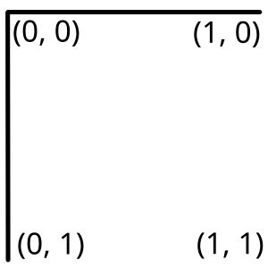

# Screens and You

Creating a custom screen manually is quite a big effort. Instead you can consider using an existing GUI library:

 - [MoulConfig](https://notenoughupdates.org/MoulConfig/) is a config library with some features for custom GUIs based on NEUs GUIs.
 - [Elementa](https://github.com/EssentialGG/Elementa) is a gui library made by sk1er. It mainly targets Kotlin, an alternative programming language to Java, but can in theory also be used from Java.
 - [Vigilance](https://github.com/EssentialGG/Vigilance) is fully automated Elementa for config GUIs only.
 - [OneConfig](https://docs.polyfrost.org/oneconfig/) is a config library made by Polyfrost.
 - or just do it yourself. Writing a gui is not the easiest thing in modding, but nothing allows you more customization.

## Basic Scaffold

A basic gui screen has 3 methods:

```java
public class MyGuiScreen extends GuiScreen {
    @Override
    public void drawScreen(int mouseX, int mouseY, float partialTicks) {
        drawDefaultBackground();
        super.drawScreen(mouseX, mouseY, partialTicks);
    }

    @Override
    protected void keyTyped(char typedChar, int keyCode) throws IOException {
        super.keyTyped(typedChar, keyCode);
    }

    @Override
    protected void mouseClicked(int mouseX, int mouseY, int mouseButton) throws IOException {
        super.mouseClicked(mouseX, mouseY, mouseButton);
    }
}
```

`drawScreen` is called every frame and is used to render things onto the screen. Note that you *first* call `drawDefaultBackground()` (which tints the background dark) and then call `super.drawScreen()` (which renders widgets on your screen).

`keyTyped` is called whenever a key is pressed. You can check `typedChar` to see the character they typed, or you can check `keyCode` if you want to know the key they pressed. For example a key like <kbd>F7</kbd> would not have a `typedChar`, but would have the `keyCode == Keyboard.KEY_F7`. We also call `super.keyTyped()` here so that the standard <kbd>Escape</kbd> to close works.

`mouseClicked` is called whenever the mouse is clicked in your screen. The `mouseButton` sadly doesn't have a vanilla class with namese for them like `Keyboard`, but you can use these constants instead: 

```java
public static final int MOUSE_LEFT = 0;
public static final int MOUSE_RIGHT = 1;
public static final int MOUSE_MIDDLE = 2;
public static final int MOUSE_BACKWARD = 3;
public static final int MOUSE_FORWARD = 4;
```

You can also always access the `width` and `height` fields to get the screen width and height to layout your components.

## Adding buttons

Vanilla has a system for buttons already built in, which i am using for a simple color selector:

```java
int lastClickedButton = 0;

@Override
public void initGui() {
    super.initGui();
    // Add buttons to the gui list during gui initialization
    this.buttonList.add(new GuiButton(0, width / 2 - 55, height / 2 - 10, 30, 20, "§cRED"));
    this.buttonList.add(new GuiButton(1, width / 2 - 15, height / 2 - 10, 30, 20, "§9BLUE"));
    this.buttonList.add(new GuiButton(2, width / 2 + 25, height / 2 - 10, 30, 20, "§2GREEN"));
}

@Override
protected void actionPerformed(GuiButton button) throws IOException {
    // When a button is clicked saved that last id (or do something else based on the id)
    // You could change a setting here for example
    lastClickedButton = button.id;
}

@Override
public void drawScreen(int mouseX, int mouseY, float partialTicks) {
    // Draw the background tint
    drawDefaultBackground();

    // Find the last selected color
    int color = 0;
    if (lastClickedButton == 0) {
        color = 0xFFFF0000;
    } else if (lastClickedButton == 1) {
        color = 0xFF0000FF;
    } else if (lastClickedButton == 2) {
        color = 0xFF00FF00;
    }

    // Draw a colorful rectangle
    drawGradientRect(width / 2 - 65, height / 2 - 20, width / 2 + 65, height / 2 + 20, color, color);

    // Draw buttons
    super.drawScreen(mouseX, mouseY, partialTicks);
}

```



## Rendering text and images

Instead of using built in buttons and basic rectangles, you can also render more complex things.

### Rendering text

You can easily use Minecrafts built in font renderer to render any text you like.

```java
@Override
public void drawScreen(int mouseX, int mouseY, float partialTicks) {
    // Draw tinted background
    drawDefaultBackground();

    // Draw an outline rectangle
    drawGradientRect(width / 2 - 100, height / 2 - 20, width / 2 + 100, height / 2 + 20, 0xFF808080, 0xFF808080);

    FontRenderer fr = Minecraft.getMinecraft().fontRendererObj;
    String text = "Hello, World!";
    int textWidth = fr.getStringWidth(text);

    // Draw a string left aligned
    fr.drawString(text, width / 2 - 95, height / 2 - 18, -1);

    // Draw a string center aligned
    fr.drawString(text, width / 2 - textWidth / 2, height / 2 - 8, -1);

    // Draw a string right aligned
    fr.drawString(text, width / 2 + 95 - textWidth, height / 2 + 2, -1);
}
```



### Rendering images

Images in Minecraft are rendered from the assets folder. In your project, you should have a folder called `src/main/resources`. In that folder you create two more folders called `assets/<yourmodidhere>/`. That is your asset root. In here you can put any file you want and load it into Minecraft. You probably want your textures to be in a folder like `textures/gui` *inside* your asset root however (`src/main/resources/assets/<yourmodidhere>/textures/gui/mytexture.png`).

For images you probably want to use png files.

For this tutorial you can use [this background](img/background.png).


```java
@Override
public void drawScreen(int mouseX, int mouseY, float partialTicks) {
    // Draw tinted background
    drawDefaultBackground();

    Minecraft minecraft = Minecraft.getMinecraft();

    // First we need to bind the texture
    minecraft.getTextureManager().bindTexture(new ResourceLocation("examplemod"/* or your modid */, "textures/gui/background.png"));

    // Render from your texture.
    drawModalRectWithCustomSizedTexture(
            // The first two arguments are the position on the screen
            width / 2 - 100, height / 2 - 20,
            // The next arguments are the starting u and v
            0, 0,
            // The next arguments are the size on the screen
            200, 40,
            // The last two arguments are the size of the texture
            200, 40
    );

    FontRenderer fr = minecraft.fontRendererObj;
    String text = "Hello, World!";
    int textWidth = fr.getStringWidth(text);

    // Draw a string left aligned
    fr.drawString(text, width / 2 - 95, height / 2 - 15, 0xFF000000);

    // Draw a string center aligned
    fr.drawString(text, width / 2 - textWidth / 2, height / 2 - 5, 0xFF000000);

    // Draw a string right aligned
    fr.drawString(text, width / 2 + 95 - textWidth, height / 2 + 5, 0xFF000000);
}
```

#### UVs

Texture rendering in OpenGL (which is what Minecraft uses) uses UVs for reading from a texture. Instead of always rendering an entire texture, you can render only parts of a texture. This allows you to reuse a texture, without rebinding it, which can be beneficial for performance. For now I wouldn't worry about optimizing like that too much, but you'll still need to use UVs anyway.

The U component goes along the x axis of the image and starts with 0 at the left and ends with 1 at the right. The V component goes along the y axis of the image and starts with 0 at the top and ends with 1 at the bottom. This is specific to OpenGL, other game engines might have different UV coordinate spaces.



To calculate the actual uv you want to start with in game, just divide the pixel coordinate by the texture size: 

```java
float u = 16 / 64; // start at x pixel coordinate 16 with a 64 wide image
```


## GlStateManager

`GlStateManager` is a class that changes the behaviour of all other rendering calls.

### Transformations

`GlStateManager` has a so called "matrix stack" which stores a set of transformations that get applied to all render calls you do. Only the top layer of the matrix stack affects your render calls.

#### Translations

Translations move things around. `translate(10, 0, 0)` would cause all future render calls to instead render 10 pixels to the right. You may notice that `translate` takes 3 arguments. This is because the `z` direction is also translated. This is useful in 3D, but can be used in 2D GUI rendering as well to move things in front of other things. In a GUI a greater z value means that something renders in front of something that has a lower z.

You can use this to render a tooltip for example. By default later rendering calls in your method would render on top of the tooltip, but if you first translate to a high z value and then back to normal after your tooltip rendering, the other method calls won't render on top of the tooltip.

#### Scaling

Scalings, well, *scale* things. This means a `scale(2, 2, 1)` call would render everything after twice as big. But you need to be careful. Everything is twice as big, including the coordinates at which you render.

```java
GlStateManager.scale(2, 2, 1);

fontRenderer.drawString("Hello, World!", 10, 10, -1);
```

This would normally render at `(10, 10)`. But since everything is scaled two times, it actually renders at `(20, 20)` and twice as big. To circumvent that you can instead first translate, then scale, and then render at `(0, 0)`.

```java
GlStateManager.translate(10, 10, 0);
GlStateManager.scale(2, 2, 1);

fontRenderer.drawString("Hello, World!", 0, 0, -1);
```

Alternatively you can do the math and divide all coordinates by your current scale factor.

!!! warning
    Please always use `1` as a scale factor for the z direction. If you do not do this, a lot of rendering calls will break and parts of your GUI might just not render at all or in the wrong order. You can use other non-zero scale factors for z like `2` sometimes, but in almost all cases that is the **wrong behaviour** and you should instead use the scale factor `1`.

#### Stack Manipulation

I mentioned earlier that the GlStateManager has a matrix stack. Your transformations and render calls only ever use the topmost matrix on that stack. Those other layers have a purpose however. Since you always want to hand back the GlStateManager in the same state you got it (otherwise all of Minecraft renders 10 pixels to the side. *oops*) you might be tempted to manually undo all your `translate` and `scale` calls. While this is doable, a much easier way is to instead use the matrix stack.

You can push a new matrix to the stack by using `pushMatrix`. This copies the current top matrix (with all the transformations applied by earlier code) and makes that new matrix the top matrix. Then after your code is done you can just call `popMatrix` and that top matrix is discarded and the old matrix with all the old transformations is used for the rest of the code. Just put your rendering and transformation calls inside of those two method calls and all should work out. (Of course inside of the `pushMatrix` `popMatrix` environment transformations still only apply to code after the transformation is applied.)

```java
GlStateManager.pushMatrix();
GlStateManager.translate(Math.random() * 100, Math.random() * -30, 200000);
// more wacky transformation calls here
// then comes your rendering code
fr.drawString("Hi", 0, 0, -1);
GlStateManager.popMatrix();
// And here everything is normal again
```


#### Rotation

Rarely you might also want to rotate things. Rotation works a bit differently than how you might expect it. A common way of doing rotation is with euler angles, so basically just rotation around x, y and z as 3 values. This has a lot of drawbacks, but is quite easy to visualize and is commonly used in 3D modeling software.

Minecraft instead uses rotations around a vector. This means you choose the axis you want to rotate around, and then you choose the angle. If you want to rotate around x, y and z after one another, you need to make 3 rotate calls this way.

Remember, like with the other transformations, the Z direction points out of the screen towards the "front".

```java
GlStateManager.pushMatrix();
GlStateManager.translate(width / 2, height / 2 - 5 + fr.FONT_HEIGHT / 2, 0);
GlStateManager.rotate((float) ((System.currentTimeMillis() / 200.0) % (360)), 0, 0, 1);
fr.drawString(text, -textWidth / 2, -fr.FONT_HEIGHT / 2, 0xFF000000);
GlStateManager.popMatrix();
```

### Attributes

In addition to transformations you can also change "attributes" about the render calls. These can be occasionally useful, but are a bit more complicated.

#### Stack Manipulation

Like the matrix stack for  transformations there is also an "attribute stack" for attributes. That one is severly broken in Minecraft, however. There is a bug in `GlStateManager` that means that if you set an attribute using `GlStateManager` inside of a `pushAttrib`-`popAttrib` block, you sometimes cannot set that attribute again. This means when inside of such a block you cannot call Minecrafts wrappers in `GlStateManager` and you need to instead call OpenGL directly. I recommend against using this however, since vanilla code you call might still use `GlStateManager`, therefore breaking attributes until the next frame. Use these two methods very carefully if at all.

#### Color

`GlStateManager.color` is probably the easiest example of an attribute. You can use it to tint all your future render calls, including textures and text. You probably already set a color using `fr.drawString`, since that has a color argument, which in turn just calls `GlStateManager.color` after several layers of abstractions. If you want everything back to normal, just set the color to `color(1, 1, 1, 1)`. 

#### Depth

`enableDepth` and `disableDepth` turn on and off depth testing. Meaning that the z value ignored and things with a high z value might render behind things with a low z value. Only the render order matters now, instead of the z value.

On top of that you can use `depthFunc` along with `GL11.GL_LESS`, `GL11.GL_LEQUAL`, `GL11.GL_GREATER`, `GL_ALWAYS` (which is equivalent to `disableDepth`) etc, to decide in which direction the depth test functions.

#### Blending

Blending specifies how transparent images render on top of each other. Again you can `enableBlend` and `disableBlend`, as well as specify the function to use to blend two images. Again, you can use values from `GL11` like `GL11.GL_ONE_MINUS_SRC_ALPHA`, `GL11.GL_ONE_MINUS_DST_ALPHA`, `GL11.GL_SRC_ALPHA` and so on with `blendFunc` or `tryBlendFuncSeparate`.

#### And many more

There are a ton of attributes, some of them more useful, some of them less. Most of them map to regular OpenGL attributes, so you can always look up OpenGL tutorials on how to use them. Or check out other mods or vanilla code to see them in action. Just remember to always reset attributes to how you got them.


## Going beyond

Minecraft has a few built in methods for drawing that I showed you in here. But Minecraft has many more, for rendering Items in UIs, and other things, but these basics should get you started. Be sure to always check out vanilla code for example usages. And if vanilla is missing something you want, you can always call the OpenGL primitives that Minecraft itself calls.

